# ISLD Pipeline — 可視化サンプル集

> 各グラフは `for_visual/` のスクリプトで生成。  
> 入力: `example_ana/out/` の CSV（本番データ 490万行ベース）

---

## A: 出願数時系列 (ts_filing_count)

### A-1. 国別 月次出願数推移
5カ国（JP / US / CN / EP / KR）の出願数を月次で比較。

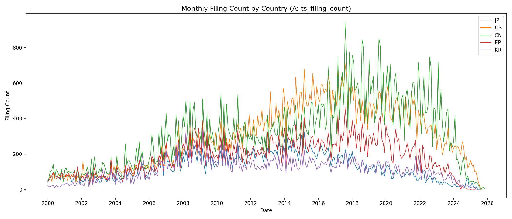

### A-2. 全体 年次出願数（棒グラフ）
ALLカテゴリの年次合算値。

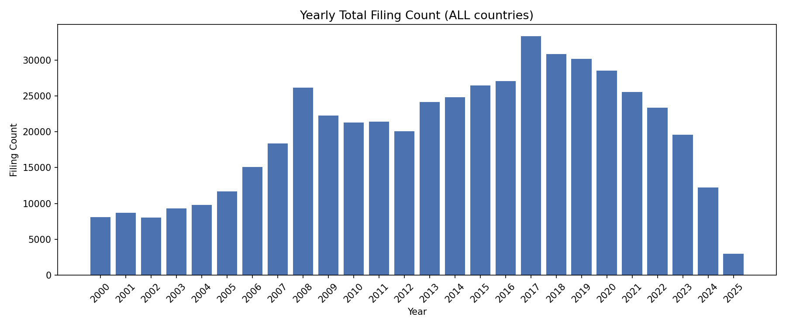

### A-3. 国別出願比率（2019年以降）
直近期間の国別シェア。

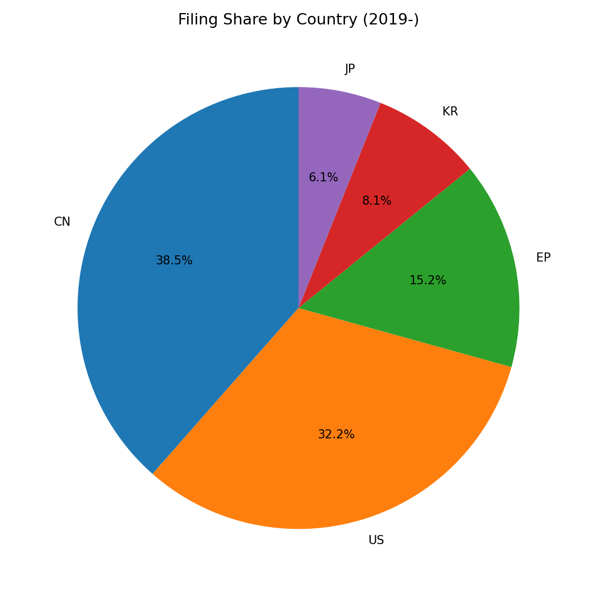

---

## B: Lag 分布サマリ (ts_lag_stats)

### B-1. 月次 Median Lag 推移（上位5社）
宣言日から出願日までの時間差（lag days）の中央値を上位5社で比較。

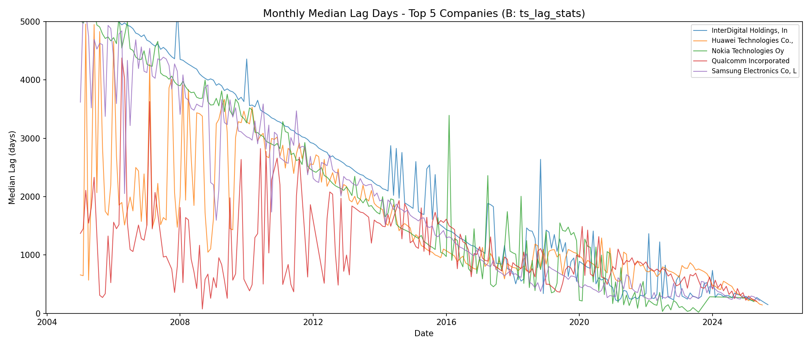

### B-2. 年次 Lag 統計（Q1–Q3レンジ）
年次平均の Q1 / Median / Q3 をプロット。

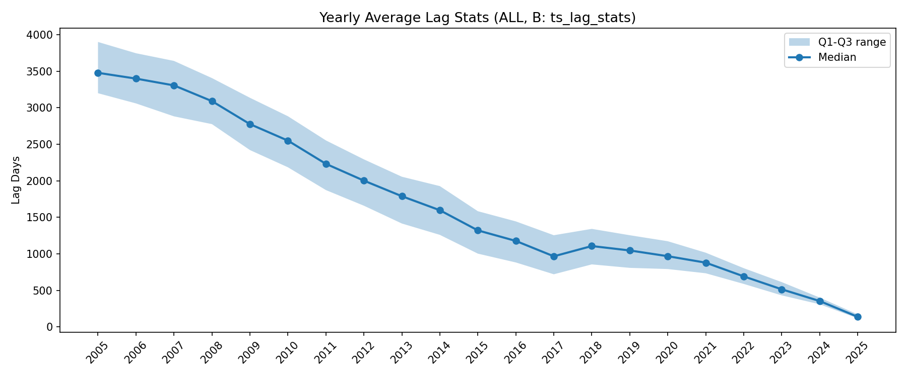

---

## C: Top Spec 時系列 (ts_top_specs)

### C-1. Top10 3GPP Spec（件数順）
全期間で最も件数の多い 3GPP 仕様番号の上位10。

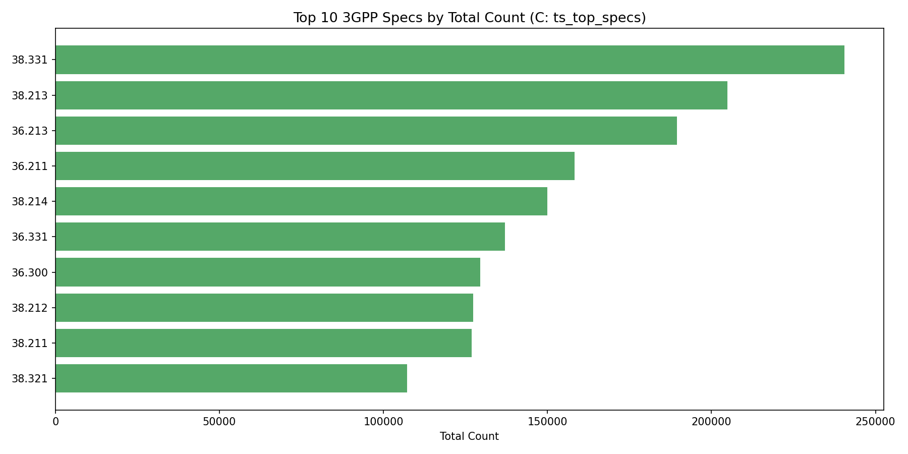

### C-2. Top5 Spec 年次推移
上位5仕様の年次トレンド。

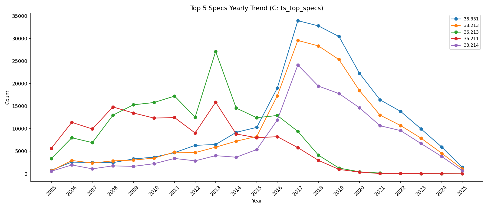

---

## D: 企業ランキング (rank_company_counts)

### D-1. Top20 企業（全体）
ALLカテゴリでの出願件数上位20社。

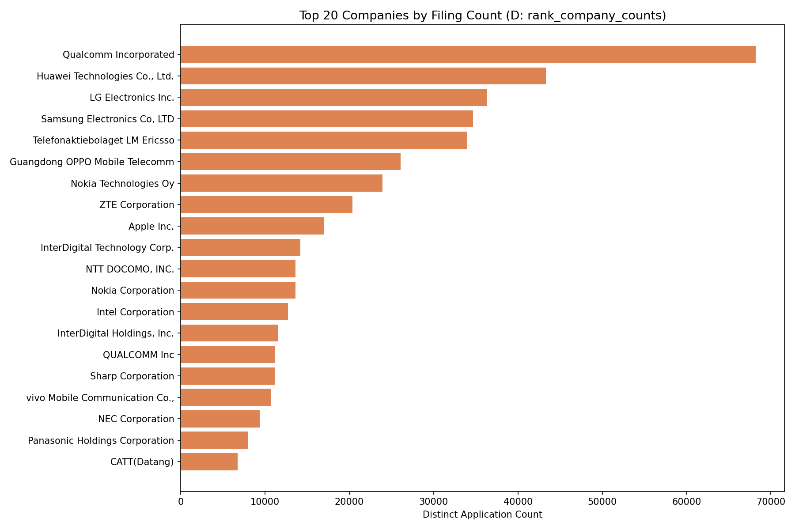

### D-2. 国別 Top5（JP / US / CN / EP / KR）
5カ国それぞれの上位5社を並列表示。

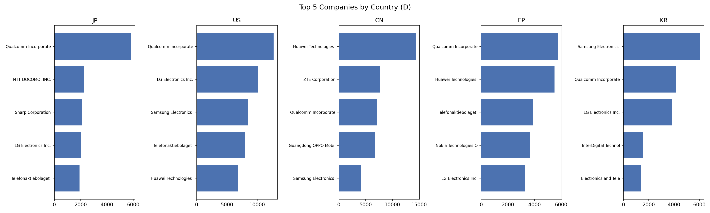

---

## E: Spec × 会社ヒートマップ (heat_spec_company)

### E-1. Top10 Spec × Top10 会社 ヒートマップ
件数上位の仕様番号と企業のクロス集計。

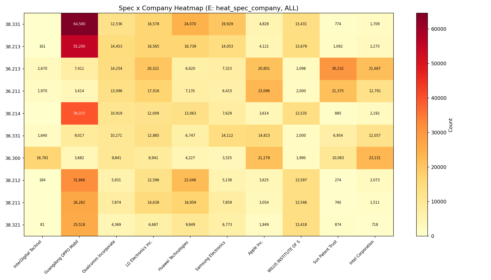

### E-2. Top10 Spec 積み上げ棒グラフ
各仕様の件数を企業別に積み上げて可視化。

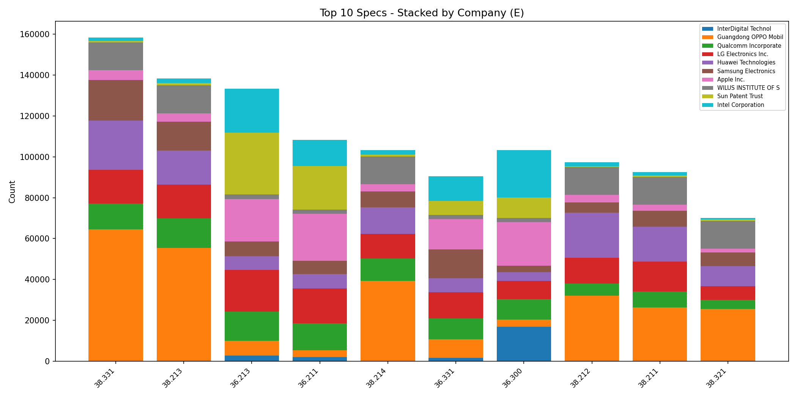

---

## スクリプト一覧

| ファイル | ジョブ | 出力PNG |
|---------|--------|---------|
| `for_visual/plot_A_filing_ts.py` | A: ts_filing_count | 3枚 |
| `for_visual/plot_B_lag_stats.py` | B: ts_lag_stats | 2枚 |
| `for_visual/plot_C_top_specs.py` | C: ts_top_specs | 2枚 |
| `for_visual/plot_D_company_rank.py` | D: rank_company_counts | 2枚 |
| `for_visual/plot_E_heatmap.py` | E: heat_spec_company | 2枚 |

### 実行方法
```bash
# 全スクリプト実行
python for_visual/plot_A_filing_ts.py
python for_visual/plot_B_lag_stats.py
python for_visual/plot_C_top_specs.py
python for_visual/plot_D_company_rank.py
python for_visual/plot_E_heatmap.py
```

> カスタムCSVパスを渡す場合: `python for_visual/plot_A_filing_ts.py my_out/A_filing_ts.csv`
